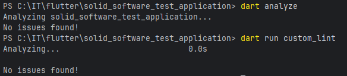

# solid_software_test_application

test app from solid software on junior position role

The application should: display the text "Hello there" in the middle of the screen and after tapping anywhere on the screen, a background color should be changed to a randomly generated color (should be able to generate 16777216 colors using RGB). Any other feature to the app - that adds bonus points

solid_lints:
